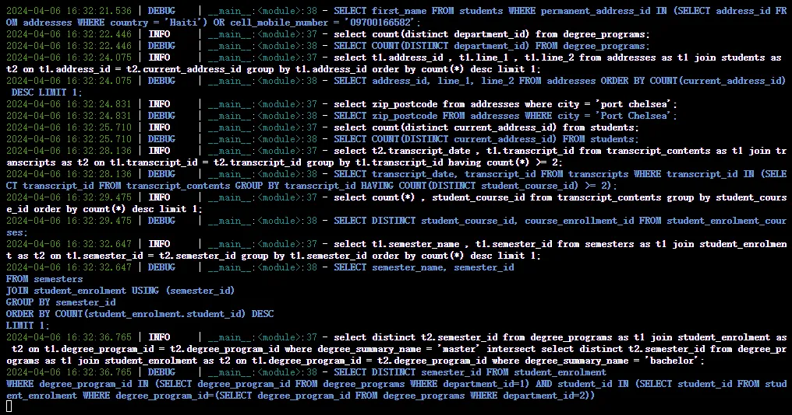
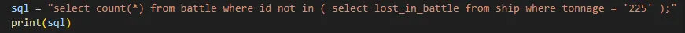
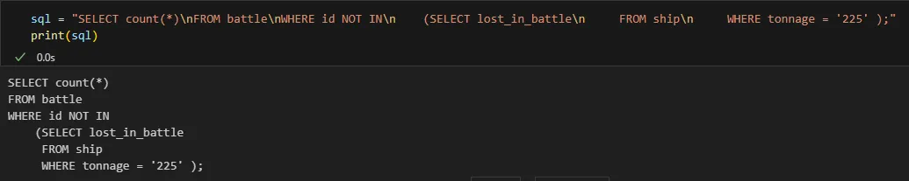

# Baichuan2-13B微调
## 微调前猜测
如图是使用 Baichuan2 官方源码，在没有微调情况下进行推理得到的结果，从结果中可以得出如下结论：

1. SQL 语句中的关键词都变成大写；
2. 标点符号都紧贴前一个单词；
3. 对于多表查询的 SQL 语句，基本使用换行符(\n)。

基于以上观察得出的结果，可猜测出 Baichuan2 在预训练时使用什么格式的预料(Text2SQL)进行训练。如果使用这种格式的数据进行微调，效果会不会有所提升呢？为了验证猜想，使用公开数据集 spider 进行测试。为了更严谨的验证猜想，主要处理如下：

1. 将 SQL 的关键词转换为大写；
2. 标点符号紧挨前一个单词；（很难处理没做）
3. 针对多表查询的 SQL 语句，使用换行符(\n)。

## 数据预处理
由于公开数据集 spider 格式有些乱，且有些 SQL 语句不能执行，在模型训练之前需要对其进行预处理，具体处理思路如下：

1. 如果某个数据库创建表的语句无法执行，那么将丢弃该数据库的所有数据；
2. spider 数据格式有问题，例如大小写没有统一、词与词之间空格太多等等
   1. 对于大小写没有统一问题，先将其全部转成小写，然后根据需要借助 sqlparse 库将 SQL 语句的关键字转成大写；
   2. 对于词与词之间的空格，只保留一个空格。
3. 对于 prompt 的构造，考虑到数据库可能存在很多张表，但在查询时通常只涉及几张表而已，如果将数据库下所有的表都作为prompt，将会引入很多无关信息。因此，如果在查询时涉及到哪些表，那么在构造 prompt 时就构造哪些表，这样相对合理一些。
### 数据一
该数据没有进行特殊处理，即没有将 SQL 关键字转化为大写；没有缩进；没有剔除错误的 SQL 语句。

### 数据二
使用 sqlparse 库对 SQL 语句进行格式化，即将 SQL 关键字转化为大写，并且有缩进，但没有剔除错误 SQL 语句。

### 数据三
在数据二的基础上剔除错误的 SQL 语句。
## 微调
经过测试，在spider 数据集，使用数据一的处理方式，prompt tokenizer 后的长度不会超过 2048，故将 model_max_length 设置为 2048；而对于数据二和数据三，将其 model_max_length 设置为 3072，其它参数均保持不变。
## 评估指标
本次实验使用的评估指标跟论文的评估指标不太一样，从工业界的角度出发，更加偏向于模型推理的准确性，即模型生成的 SQL 能否执行。因此，实验仅使用准确率（Accuracy）来衡量模型生成的质量，计算公式如下：
$$Accuracy = \frac{生成可执行的 SQL 语句数量}{生成所有 SQL 语句数量}×100%$$
## 结果
由于 spider 是公开数据，有些 SQL 语句无法执行，因此， **Acc_assist** 表示对原数据进行评估，**Acc_infer** 表示对模型生成的 SQL 语句进行评估。
### 没微调(数据一)
对多表查询和单表查询进行评估
$$Acc\_assist = \frac{841}{912}×100\%
=92.2\%$$
$$Acc\_infer = \frac{739}{912}×100\%
=81.0\%$$
只对多表查询进行评估
$$Acc\_assist = \frac{358}{414}×100\%
=86.5\%$$
$$Acc\_infer = \frac{286}{414}×100\%
=69.1\%$$
只对单表查询进行评估
$$Acc\_assist = \frac{453}{464}×100\%
=97.6\%$$
$$Acc\_infer = \frac{418}{464}×100\%
=90.1\%$$
### 微调(数据一)
对多表查询和单表查询进行评估
$$Acc\_assist = \frac{841}{912}×100\%
=92.2\%$$
$$Acc\_infer = \frac{709}{912}×100\%
=77.7\%$$
只对多表查询进行评估
$$Acc\_assist = \frac{358}{414}×100\%
=86.5\%$$
$$Acc\_infer = \frac{234}{414}×100\%
=56.5\%$$
只对单表查询进行评估
$$Acc\_assist = \frac{483}{498}×100\%
=97.0\%$$
$$Acc\_infer = \frac{487}{498}×100\%
=97.8\%$$

如果只看结果的话，微调后的性能下降3个百分点，将根据结果进行合理的分析：

1. 对于单表查询来说，性能提升了7个百分点，在看到结果提升这么多时，自然想查看一下数据的质量，从 Acc_assist 的评估结果可以看出，该数据基本都是正确的；
2. 反观多表查询，微调后的结果直接下降13个百分点，在测试数据集中，仅仅400多条 SQL 语句就有100多条是错误的，可想而知，在训练集中，错误的数据应该也不少的吧。使用错误的数据进行微调，模型应该是不能学习到正确的知识的。
### 微调(数据二)
对多表查询和单表查询进行评估
$$Acc\_assist = \frac{841}{912}×100\%
=92.2\%$$
$$Acc\_infer = \frac{740}{912}×100\%
=81.1\%$$
只对多表查询进行评估
$$Acc\_assist = \frac{358}{414}×100\%
=86.5\%$$
$$Acc\_infer = \frac{251}{414}×100\%
=60.6\%$$
只对单表查询进行评估
$$Acc\_assist = \frac{483}{498}×100\%
=97.0\%$$
$$Acc\_infer = \frac{481}{498}×100\%
=96.7\%$$
本次微调后的结果基本跟原始模型推理得到的结果基本持平，我们将根据结果做出合理的猜想，具体猜想如下：

1. 使用原始模型来生成 SQL 语句时发现，几乎所有关键词都是大写的，此外，对于多表查询时会出现换行。基于此，我们自然而然的猜想模型在预训练阶段也是使用这样的数据进行训练的，基于这样的假设，本次实验将对 SQL 语句处理成上述格式后进行微调，虽然微调后结果跟原始模型的结果基本一致。但和实验一相比，在多表查询上效果还是有所提升的，表明在遵循预训练模型数据格式的前提下进行微调，有利于提升模型的性能。
2. 从另一个角度思考问题，为什么单表查询效果会这么好，而多表查询时效果就这么差呢？个人认为无非就是数据格式、数据是否正确，以及prompt的构造是否合理。显然，该数据还是没有处理得很规范，以及有部分 SQL 语句是不能执行的，尤其是多表查询。
### 微调(数据三)
对多表查询和单表查询进行评估
$$Acc\_assist = \frac{841}{841}×100\%
=100\%$$
$$Acc\_infer = \frac{747}{841}×100\%
=88.8\%$$
只对多表查询进行评估
$$Acc\_assist = \frac{358}{358}×100\%
=100\%$$
$$Acc\_infer = \frac{268}{358}×100\%
=74.9\%$$
只对单表查询进行评估
$$Acc\_assist = \frac{483}{483}×100\%
=100\%$$
$$Acc\_infer = \frac{475}{483}×100\%
=98.3\%$$
从结果中可以看出，与没有微调的结果相比，微调后的结果有着明显的提升，主要归结为以下几个方面：

1. 对于 Text2SQL 任务，其生成的结果相对比较固定，如果在标注 label 时统一格式的话，能够有利于提升模型的性能的；
2. 模型微调后的性能取决于训练的数据，如果很多数据是错误的，那学习到的知识也是错误的，因此在处理数据时一定要确保数据的正确性。
## 结论
如果大模型只应用在特定领域的话，在构建数据之前可以思考如下问题：

1. 数据格式统一：如果期望模型生成的结果尽可能一致的话，那么在构建数据时一定得把数据做好；
2. 数据质量：实验结果表明，在数据格式相对统一且高质量的前提下，能大幅度的提升模型的性能。

## 参考链接
1. https://github.com/baichuan-inc/Baichuan2
2. https://github.com/eosphoros-ai/DB-GPT-Hub